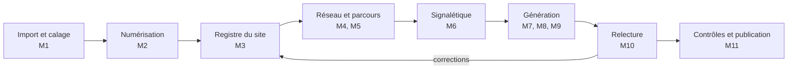

# Azimut, cahier des charges complémentaire
## Atelier de plans, parcours et signalétique

Éditeur : Atlas Studio
Auteur : Pamela ATOKOUNA
Date : 17 septembre 2026

> **Avertissement de versement.** Ce document est versé au dépôt tel qu'il a été
> remis, pour être lu et non reconstitué. Il n'a pas reçu de lettre de partie :
> ses codes de module `M1` à `M17` sont les siens et ne désignent pas la
> **partie M** (règles d'écran) sur laquelle s'appuient les parties L et N, qui
> reste absente du dépôt. Voir l'avertissement de collision en tête de CLAUDE.md.
>
> Ce document contredit sur plusieurs points des parties déjà versées et déjà
> implémentées. Ces contradictions relèvent de la procédure d'arrêt A2.2 : elles
> sont relevées au chapitre « Contradictions relevées au versement » en fin de
> document, et elles ne sont pas résolues ici.

Azimut transforme les plans d'architecte d'un site en livrables d'orientation
complets et cohérents : plan de parcours, implantation signalétique, plans
d'accueil, vue par niveaux, plan digital et contrôles, sans ressaisie et sans
rien inventer. Ce document complète le cahier des charges des bornes et
s'adresse à Claude Code pour le développement.

---

## 1. Objet et périmètre

Azimut produit, à partir des plans d'un site, tous les supports d'orientation et
les tient à jour d'une seule source. L'atelier décrit ici est le cœur de
l'application : il fabrique les plans, les parcours, la signalétique et les
données d'itinéraire. Le cahier des charges des bornes couvre l'exécution sur
borne et le pilotage du parc.

**Problème résolu.** Aujourd'hui, un plan de parcours, un plan d'implantation,
des plans d'accueil et un plan digital se refont à la main, séparément, et
divergent au premier changement : un nom d'enseigne, une règle de parking, un
tracé de promenade. Azimut garde une seule vérité et régénère tout.

### Livrables produits par Azimut

| Livrable | Format | Usage |
| --- | --- | --- |
| Plan de parcours visiteur | PDF A0 vectoriel | Travail interne, Direction |
| Plan d'implantation signalétique et nomenclature | PDF A0 et tableur | Fabricant, révision du dossier signalétique |
| Plan d'orientation général | PDF A0 et A1 | Affichage public |
| Plans d'accueil « Vous êtes ici », un par point d'arrivée | PDF A0 et A1 | Panneaux d'accueil |
| Plan de masse et vue axonométrique | PDF A0 | Commercialisation, Direction |
| Vue par niveaux avec liaisons verticales | PDF A0 et encart | Accès parking, plans d'accueil |
| Plan digital interactif | Page web, borne, mobile | Visiteurs |
| Grille d'accessibilité | Tableur | Exploitation, bureau de contrôle |
| Cartographies du parcours | PDF A1 | Stratégie, formation |
| Document de stratégie de parcours | Document partagé, Word, PDF | Direction, équipes |
| Plan digital autonome | Page web d'un seul fichier | Diffusion sans back office |
| Dossier complet | Archive en deux dossiers, travail interne et diffusion | Transmission |

**Hors périmètre de ce complément :** matériel des bornes, régie publicitaire,
fidélité, transactions. Ils restent au cahier des charges des bornes.

**Cas de référence.** Le site Cosmos Angré sert de jeu d'essai : trois plans
d'architecte, 60 cellules, quatre entrées, un parking souterrain, un parking de
surface gratuit, deux espaces gastronomiques nommés, une promenade en réseau.

---

## 2. Principes opposables

Ces règles priment sur toute fonction. Un développement qui en viole une est
refusé en recette.

| N° | Règle |
| --- | --- |
| P1 | Rien n'est inventé. Tout objet porte une source (plan, relevé, décision) et un statut : Existant, Proposition, À vérifier. Une proposition ne s'affiche jamais comme un existant. |
| P2 | Une seule vérité. Noms, faits du site, cellules, enseignes et réseau vivent dans le registre. Tous les livrables en dérivent, aucun n'est édité à la main. |
| P3 | Un seul repère géométrique par niveau. Chaque plan importé est calé sur ce repère. Aucune superposition sans calage mesuré. |
| P4 | Aucune déformation. Une projection s'applique une seule fois. Un plan déjà en relief ne reçoit pas de seconde projection. |
| P5 | Liaisons verticales vraies. Un ascenseur, un escalier ou une rampe occupe le même point sur les deux niveaux qu'il relie. |
| P6 | Validation humaine. Aucune publication sans validation d'un profil habilité. Chaque version est figée et datée. |
| P7 | Rédaction propre. Aucun tiret cadratin ou demi-cadratin, point médian, flèche, signe de multiplication, points de suspension dans un livrable. Présent de l'indicatif, pas de conditionnel. |
| P8 | Mention d'auteur. Chaque page et chaque fichier porte « Réalisé par » suivi du nom de l'auteur du projet, en bas de page, discret et lisible. Les propriétés des fichiers portent le même nom. |
| P9 | Bilingue par défaut. Français et anglais sur tout support public ; une langue s'ajoute sans développement. |
| P10 | Tête haute. Un plan d'accueil s'oriente dans le sens de marche du visiteur à ce point. |
| P11 | Correction propagée. Une correction faite une fois se répercute sur tous les livrables concernés, et le rapport de régénération le montre. |
| P12 | Traçabilité. Journal append-only chaîné en SHA-256 pour toute création, modification, validation et publication. |
| P13 | Invariants Atlas Studio. Supabase exclusivement (RLS, Edge Functions), locataire porté par le JWT, PROPH3T consultatif, module Reporting obligatoire. |

---

## 3. Chaîne de production de bout en bout

Un projet avance en huit étapes. Chaque étape a un propriétaire, une sortie et
une porte de validation ; une étape aval ne démarre pas tant que la porte amont
n'est pas franchie.

Toute correction issue de la relecture remonte au registre ou au réseau, jamais
dans un livrable. La régénération suit automatiquement.

| Étape | Sortie | Porte de validation |
| --- | --- | --- |
| Import et calage | Plans calés par niveau, résidus affichés | Résidu moyen sous le seuil (section 21) |
| Numérisation | Cellules, entrées, services, parkings, places, liaisons | Rapport de couverture validé |
| Registre | Noms officiels, faits, enseignes, logos | Registre signé par la Direction |
| Réseau et parcours | Graphe multi-niveaux, parcours nommés | Contrôle de connexité sans erreur |
| Signalétique | Emplacements, supports, nomenclature | Revue des propositions |
| Génération | Tous les livrables de la section 1 | Contrôles bloquants à zéro |
| Relecture | Annotations traitées | Plus aucune annotation ouverte bloquante |
| Publication | Version figée, plan digital en ligne | Validation du profil habilité |

---

## 4. M1 Import et calage des plans

M1 accepte les plans tels que les architectes les livrent et les ramène tous
dans un repère commun par niveau, avec une erreur mesurée.

**Formats acceptés :** PDF vectoriel, DXF, IFC en phase 3, image (PNG, JPG) en
dernier recours avec avertissement « précision limitée ». Les fichiers DWG ne
sont pas acceptés : l'architecte fournit un DXF ou un PDF vectoriel.

### Fonctions

1. **Lecture vectorielle.** Extraction des segments, courbes, remplissages et
   textes avec leurs couleurs, épaisseurs et calques, y compris hors du cadre de
   page. Un contenu découpé par la page est signalé : « le plan source s'arrête
   au bord, zone non couverte ».
2. **Nettoyage.** Masquage des calques inutiles (cotes, cartouche, hachures
   techniques) par règles enregistrées et réutilisables d'un projet à l'autre. Le
   plan brut reste consultable.
3. **Échelle.** Détection de l'échelle graphique ou saisie de deux points et
   d'une distance réelle. Le résultat s'affiche en points par mètre.
4. **Calage.** L'utilisateur pose au moins trois paires de points homologues
   (angle de bâtiment, entrée, ascenseur, portail). Azimut calcule une
   transformation affine par moindres carrés et affiche le résidu de chaque point
   en mètres. Au-delà du seuil, le point s'affiche en rouge.
5. **Plans d'un même niveau.** Plan architectural (couche sûreté et technique) et
   plan commercial (couche enseignes) se superposent dans le même repère ; chaque
   objet numérisé garde la trace du plan qui le fonde.
6. **Plans de niveaux différents.** Le rez-de-jardin se cale sur le
   rez-de-chaussée par les liaisons verticales connues (ascenseur, escalier,
   rampe) et par l'échelle de chaque plan. Une seule liaison connue suffit à
   positionner, deux fixent l'orientation ; Azimut affiche le nombre de liaisons
   utilisées.
7. **Nord.** Relevé du nord géographique sur le plan source, stocké par niveau.

### Règles

- Un plan sans échelle ni calage reste en statut « non exploitable » et ne
  produit aucun livrable.
- Un recalage recalcule toutes les coordonnées dérivées et relance les contrôles.

**Critères d'acceptation :** sur Cosmos Angré, les quatre entrées du plan
d'orientation se recalent sur le plan architectural avec un résidu inférieur à
0,1 m ; le rez-de-jardin se cale sur l'ascenseur 1 et les rampes tombent dans le
parking Ouest.

---

## 5. M2 Numérisation du site

M2 transforme le dessin en objets métier géoréférencés, que tous les autres
modules consomment.

### Objets numérisés

| Objet | Géométrie | Attributs clés |
| --- | --- | --- |
| Cellule | Polygone | Code (C14, R1, FC2), surface, niveau, statut locatif |
| Espace nommé | Polygone | Nom officiel, type (espace gastronomique, parvis, terrasse, promenade, zone expo) |
| Entrée | Point et direction | Numéro, sens d'entrée, type (galerie, piétonne, service) |
| Service | Point | Type (sanitaires, coin bébé, DAB, ascenseur, escalier, PMR, dépose-minute, bus) |
| Parking | Polygone | Nom, niveau, gratuité, capacité, places réservées |
| Place de stationnement | Segment ou polygone | Type (standard, PMR, livraison), rangée |
| Liaison verticale | Point sur chaque niveau | Type (ascenseur, escalier, rampe piétonne, rampe véhicule), niveaux reliés, accessible PMR |
| Portail et accès véhicule | Point | Code (V1 à V5), rôle, largeur |
| Élément paysager | Polygone ou point | Massif, arbre, gradins, bancs |

### Modes de saisie

1. **Détection assistée.** Azimut propose les polygones fermés, les rangées de
   places (traits parallèles répétés) et les pictogrammes reconnus. Chaque
   proposition arrive en statut « À vérifier ».
2. **Saisie manuelle** sur le plan calé, avec accrochage aux traits du plan
   source.
3. **Reprise d'un existant :** import d'un état locatif (tableur) rapproché des
   codes de cellule.

### Règles

- Les places de stationnement se reprennent du plan source, trait pour trait. Là
  où le plan source s'arrête, la zone est marquée « non couverte » ; Azimut ne
  complète pas par extrapolation.
- Une cellule sans code ou un code en double bloque la porte de validation.
- Rapport de couverture : pour chaque niveau, part des objets validés, proposés
  et manquants.

**Critères d'acceptation :** les places du parking Ouest et des deux premières
rangées du parking de surface de Cosmos Angré sont reprises à l'identique ; la
partie basse est signalée non couverte.

---

## 6. M3 Registre du site : noms officiels, faits, statuts

M3 est la source unique de tout ce qui s'écrit sur un support. Un changement ici
se propage partout.

### Trois registres

1. **Lexique des destinations.** Pour chaque lieu : nom officiel français, nom
   anglais, variantes interdites, abréviation autorisée. Exemple : « Le Comptoir
   des Douceurs », variante interdite « Espace gastronomique Nord », « Food court
   1 ». Une variante interdite trouvée dans un livrable est une erreur bloquante
   (M11).
2. **Faits du site.** Affirmations vérifiées qui conditionnent des textes :
   parking gratuit, nombre de niveaux de parking, horaires, date d'ouverture,
   présence ou absence de barrière. Chaque fait porte une valeur, une source, une
   date et un auteur. Des règles d'incompatibilité lui sont attachées : « parking
   gratuit » interdit les mots paiement, payant, tarif, caisse de parking, borne
   de paiement dans tout livrable.
3. **Enseignes.** Nom, catégorie, cellules, statut (ouverte, en travaux, à
   venir), logo, horaires, lien avec le référentiel enseignes des bornes. Une
   marque de l'enseigne mère n'apparaît pas si la Direction l'a exclue (exemple :
   Carrefour remplacé par Supermarché sur les jalonnements).

**Statuts d'un objet :** Existant, Proposition, À vérifier, Retiré. Un objet
retiré reste dans l'historique et disparaît des livrables.

### Fonctions

- Import d'une liste de logos en archive : rapprochement automatique par nom de
  dossier, choix du fichier (noir sur fond clair, blanc sur fond sombre),
  recadrage automatique, suppression du fond blanc ou du faux damier, extraction
  du lettrage quand le fichier est une planche d'enseigne cotée. L'utilisateur
  valide chaque logo sur une planche de contrôle.
- Logos sans correspondance listés avec la raison (absent de l'index, nom
  différent). Aucun rapprochement flou n'est validé sans l'utilisateur.
- Recherche d'usages : pour un nom ou un fait, liste de tous les livrables et
  emplacements où il apparaît.

**Critères d'acceptation :** renommer « Espace gastronomique Sud » en « La Halle
Gourmande » met à jour plans, nomenclature, plan digital et cartographies en une
action, et le rapport de régénération liste chaque occurrence modifiée.

---

## 7. M4 Réseau de circulation et itinéraires

M4 porte un graphe unique de cheminements, tous niveaux confondus, dont dérivent
distances, temps de marche, tracés et besoins de signalétique.

### Graphe

- **Nœuds :** entrées, croisements, pieds et têtes de liaison verticale, portes
  de cellule, services, points d'arrivée (dépose-minute, arrêt de bus, entrée
  piétonne, parkings), bornes.
- **Arêtes :** tronçon avec géométrie (polyligne), longueur calculée en mètres à
  partir du calage, milieu (galerie, terrasse, promenade, parvis, parking),
  revêtement, pente, présence de marches, éclairage, ombrage, horaires
  d'ouverture.
- **Arêtes verticales :** ascenseur, escalier, rampe, avec coût propre (attente
  d'ascenseur paramétrable).

### Saisie

- Tracé à la souris sur le plan calé, avec accrochage aux nœuds et aux bords des
  objets.
- Import d'un tracé dessiné en surimpression par la relectrice (M10) : le trait
  est converti en polyligne, recalé sur le plan, puis proposé en remplacement du
  tronçon existant.
- Contrôle de connexité : tout nœud public doit rejoindre toutes les entrées. Un
  tronçon isolé est signalé.

### Calcul d'itinéraire

1. Algorithme A* sur le graphe pondéré, poids = longueur, plus pénalités
   paramétrables.
2. Profils : standard, sans marche (PMR, poussette, caddie), le plus abrité, le
   plus court en temps.
3. Temps de marche : vitesse par défaut 75 m par minute, paramétrable par
   profil ; arrondi à la minute, minimum 1 minute.
4. Précalcul pour chaque borne et chaque destination, stocké et invalidé dès que
   le graphe change. La borne fonctionne hors ligne sur le précalcul.
5. Départ parking : un point d'arrivée au rez-de-jardin emprunte la liaison
   verticale la plus adaptée au profil puis poursuit au rez-de-chaussée. La
   phrase affichée nomme la liaison et l'entrée (« par l'ascenseur 1 et l'entrée
   4 »).

**Sorties :** tableau des accès à pied (depuis, vers, distance, temps), tracés
pour les plans, données d'itinéraire pour le plan digital.

**Critères d'acceptation :** les distances du tableau d'accès de Cosmos Angré se
recalculent à plus ou moins 5 m ; un itinéraire PMR n'emprunte jamais l'escalier.

---

## 8. M5 Parcours visiteur

M5 regroupe des tronçons du graphe en parcours nommés, avec leur style, leur
longueur et leur rôle dans l'expérience.

### Types de parcours

| Type | Exemple Cosmos Angré | Style par défaut |
| --- | --- | --- |
| Trajet d'arrivée | Parking vers entrée 4 | Trait plein terre cuite |
| Circulation intérieure | Galeries, croisements, distances | Trait terre cuite avec nœuds |
| Promenade | Réseau autour de la Zone Expo vers le parking | Pointillé vert sur bande claire |
| Parcours de terrasse | Entrée 1 à entrée 4 le long des enseignes | Tirets couleur terrasse |
| Itinéraire accessible | Places réservées vers entrées | Tirets bleus |
| Circulation véhicules | Portails vers parkings | Tirets gris, sens à confirmer |

### Fonctions

- Un parcours se compose de tronçons du graphe ; il ne possède pas de géométrie
  propre. Modifier le graphe met le parcours à jour.
- Deux parcours qui partagent un tronçon s'affichent décalés et parallèles,
  jamais superposés.
- Longueur calculée et libellé automatique (« Promenade, 365 m de cheminements »).
- Zones d'ambiance associées au parcours (terrasse, parvis à gradins), avec leur
  légende.
- Moments de vérité et points d'attente positionnés sur le parcours, reliés aux
  cartographies (parcours visiteur, carte d'expérience, plan de service).

### Cartographies générées

1. **Carte du parcours visiteur :** étapes, personas, émotions, irritants,
   opportunités.
2. **Carte d'expérience :** couches digitale, physique et humaine, intensité
   émotionnelle, version schématique et version sur le site.
3. **Plan de service :** preuves physiques, actions visiteur, front, back,
   support, points de rupture et d'attente avec norme et pilote.

Les courbes d'émotion restent marquées « hypothèse de travail » tant qu'aucune
mesure ne les confirme.

**Critères d'acceptation :** retracer la promenade depuis un croquis annoté
produit le réseau à branches, recalcule la longueur et met à jour les quatre
supports concernés.

---

## 9. M6 Signalétique : implantation et nomenclature

M6 place les supports là où le réseau les exige, les numérote, et tient la
nomenclature que le fabricant chiffre.

**Catalogue des types.** Code (100 à 390), désignation, famille (orientation,
identification, réglementaire, service, accessibilité), couleur de famille,
nombre maximal de mentions par face, hauteur de pose, pose (mural, suspendu, sur
mât, au sol), intérieur ou extérieur. Le catalogue est importé du dossier
signalétique du site et reste modifiable.

### Moteur d'implantation

| Règle | Effet |
| --- | --- |
| R1 Point de décision | Un support d'orientation à chaque nœud de degré 3 ou plus, tête d'escalier, sortie d'ascenseur, départ de couloir |
| R2 Rappel | Un rappel dès que deux supports d'un même parcours sont distants de plus de 25 m (paramétrable) |
| R3 Séquence d'entrée | Identification, accueil, horaires, répertoire, sortie, adhésif de vitrage à chaque entrée |
| R4 Messages | Destinations tirées du lexique M3, cinq mentions au plus par face, ordre par distance |
| R5 Parking | Repère de travée par allée, jalonnement piéton vers la liaison verticale, place réservée par place PMR |
| R6 Non-doublon | Pas deux supports du même type à moins de 5 m |

- Chaque support posé par le moteur naît en statut Proposition. L'utilisateur
  l'accepte, le déplace ou le rejette ; le motif du rejet est conservé et le
  moteur ne le repropose pas.
- Un emplacement regroupe plusieurs supports (exemple : six supports à une
  entrée).
- Numérotation stable : un emplacement garde son numéro à vie ; les nouveaux
  prennent le numéro suivant. Identifiant support : famille, type, rang
  (OR-140-11).
- Messages par face générés depuis le graphe : pour chaque face, les destinations
  atteignables dans la direction regardée.

**Nomenclature** tenue en direct : emplacement, identifiant, type, désignation,
emplacement lisible, étape du parcours, message indicatif, statut. Totaux par
type et total général recalculés, jamais saisis.

**Exports :** nomenclature tableur, cahier de messages par face, dossier
fabricant (gabarits cotés, quantités, pose), plan d'implantation.

**Critères d'acceptation :** ajouter trois jonctions à la promenade crée trois
propositions de mât à lames, et le compteur passe de 111 à 114 supports sur la
légende et sur la nomenclature en même temps.

---

## 10. M7 Générateur de plans

M7 compose chaque livrable à partir du registre, du réseau et de la
signalétique, dans la charte du site, en PDF vectoriel imprimable.

### Gabarits de plan (paramétrables par site)

| Gabarit | Contenu | Projection |
| --- | --- | --- |
| Parcours visiteur | Fond nettoyé, zones d'ambiance, parcours, nœuds, points de contact numérotés, tableau d'accès à pied, points à traiter | Plan à l'échelle |
| Implantation | Fond, emplacements et types, légende des types avec totaux, règles appliquées, points à arrêter | Plan à l'échelle |
| Orientation général | Volumes, cellules colorées par catégorie, numéros, logos, index bilingue, services | 2.5D |
| Accueil « Vous êtes ici » | Idem, repère rouge, orientation tête haute, encart de niveaux si liaison proche | 2.5D pivotée |
| Masse | Emprises, surfaces, stationnement, accès, légende | Plan et axonométrie |
| Nomenclature | Tableau paginé, zébré | Tableau |

### Moteur de projection

- **Plan :** transformation affine du repère de niveau vers la page.
- **2D et 2.5D :** les deux vues sont produites par défaut pour chaque niveau. En
  2.5D, compression verticale paramétrable (0,8 par défaut) et extrusion des
  volumes selon leur hauteur saisie ; les hauteurs non relevées s'affichent
  « indicatives ».
- **Tête haute :** rotation de la carte selon le sens de marche au point
  d'arrivée. Les étiquettes, numéros, pictogrammes et logos restent droits : ils
  se positionnent par leur ancre transformée, jamais par rotation du texte. La
  flèche du nord tourne avec la carte.
- **Découpage :** chaque carte est coupée à son cadre ; rien ne déborde sur le
  cartouche.

### Mise en page automatique

1. **Anticollision des étiquettes :** priorité entrées, puis services, puis
   enseignes, puis numéros ; décalage, réduction ou appel en marge. Aucune
   étiquette ne masque un repère ; le contrôle QC-02 le vérifie.
2. Logos posés sur pastille dans l'index et sur la cellule quand la place le
   permet, sinon index seul.
3. Légendes générées à partir des éléments réellement présents sur la carte.
4. Bilingue : libellé français, traduction anglaise en italique dessous.
5. Cartouche : logo du site adapté au fond (version claire ou sombre), titre,
   sous-titre, source du fond, indice de version, date, mention d'auteur.
6. Formats A0, A1, A3 ; fond perdu et traits de coupe sur demande ; PDF/X-4 pour
   l'imprimeur.

**Critères d'acceptation :** la page de l'entrée 1 de Cosmos Angré sort pivotée,
étiquettes droites, repère « Vous êtes ici » sans masquer la cellule 51 ; aucune
page ne contient de texte débordant du cadre.

---

## 11. M8 Vue par niveaux

M8 empile les niveaux d'un site et montre comment passer de l'un à l'autre, sans
déformer aucun plan.

### Règles de construction

1. Tous les niveaux sont dessinés dans la même projection, celle du plan
   d'orientation. Aucune projection supplémentaire n'est appliquée par-dessus
   (P4).
2. Chaque niveau se place sous son emprise réelle, par le calage M1. Le décalage
   entre niveaux est uniquement vertical.
3. Les liaisons verticales sont des traits verticaux purs, colorés par liaison,
   avec un repère lettré identique aux deux extrémités (A, B, C). Si une liaison
   n'est pas relevée au niveau supérieur, Azimut la place à l'aplomb du point
   inférieur et la marque « à vérifier ».
4. Ordre de dessin : niveau bas, traits de liaison, niveau haut, repères. Un
   trait ne masque jamais un repère.
5. Les mezzanines privées des enseignes ne sont pas représentées comme niveau
   public.

### Contenu

- Étiquette de niveau (RDC, RDJ, R+1) avec nom bilingue.
- Légende des liaisons : lettre, couleur, type, nom bilingue, accessibilité PMR.
- Mention en pied : projection utilisée, liaison de calage, éléments non
  représentés.

### Déclinaisons

- Page pleine du plan d'orientation.
- Encart automatique sur tout plan d'accueil situé à moins de 30 m
  (paramétrable) d'une liaison vers un parking.
- Couche de niveaux du plan digital (M9).
- Vue 3D (phase 3) : niveaux en plateaux orbitables, même données.

**Critères d'acceptation :** sur Cosmos Angré, l'ascenseur 1 tombe à l'entrée 4
sur les deux niveaux, les rampes C et D arrivent dans le parking Ouest, et aucun
plan n'apparaît cisaillé ou étiré.

---

## 12. M9 Plan digital et publication

M9 publie une version validée sur la borne, le site web et le mobile, à partir
des mêmes données que les plans imprimés.

### Fonctions visiteur

- Choix de la langue (français, anglais, langues ajoutées).
- Choix du point de départ : chaque borne, chaque entrée et chaque parking, y
  compris le parking souterrain.
- Choix du niveau : bouton par niveau ; le niveau du point de départ s'affiche
  d'office.
- Recherche par enseigne, catégorie, marque, produit ; filtres par catégorie.
- Fiche enseigne : nom, catégorie, cellule, logo, distance et temps de marche
  depuis le point de départ.
- Tracé animé de l'itinéraire, changement de niveau matérialisé par la liaison
  empruntée et une phrase explicite.
- Profil sans marche activable.
- Envoi de l'itinéraire vers le mobile par QR code.
- Zoom, déplacement, vue d'ensemble, au toucher et à la souris.
- Mode clair et mode sombre, logo adapté.
- Mention d'auteur en pied du panneau, dans la langue choisie.

### Fonctions visiteur complémentaires, toutes exigées

| Fonction | Comportement attendu |
| --- | --- |
| Carte 2.5D | Même projection et mêmes volumes que le plan d'orientation imprimé, cellules colorées par catégorie, numéros, services, entrées, parkings et places |
| Sélection sur la carte | Toucher une cellule ouvre la fiche de l'enseigne |
| Surbrillance | Les cellules de l'enseigne choisie se mettent en évidence, repère de destination au bout du tracé |
| Liste des enseignes | Numéro coloré, nom, catégorie, distance depuis le départ actif, mise à jour au changement de départ |
| Recherche | Par nom, catégorie et code de cellule, sans tenir compte des accents ni des majuscules ; message clair si aucun résultat |
| Filtres | Pastilles de catégorie, couleur ajustée pour le contraste, sélection unique réversible |
| Libellés bilingues | Les lieux de la carte, la légende, les boutons et les phrases changent avec la langue |
| Tracé | Animation du tracé avec halo, phrase de distance et de temps, mention de la liaison et de l'entrée quand le départ est au parking |
| Niveaux | Bouton par niveau ; le niveau parking affiche le plan du rez-de-jardin dans la même projection, les liaisons lettrées et leur légende |
| Repère de départ | Épingle « Vous êtes ici » au point de départ choisi |
| Navigation | Zoom par boutons, molette et pincement ; déplacement au glisser ; bouton de vue d'ensemble |
| Légende | Vous êtes ici, entrée, sanitaires et coin bébé, parking et accès PMR, liaisons au niveau parking |
| Accessibilité | Libellés ARIA traduits, navigation au clavier, contraste AA |
| Apparence | Mode clair et mode sombre suivant l'appareil, logo adapté |
| Autonomie | Un seul fichier HTML, sans dépendance réseau hors polices, aucune erreur console |
| Mention | « Réalisé par » et l'auteur en pied du panneau, dans la langue active |

### Publication

1. Export d'un paquet versionné : carte vectorielle par niveau, lexique,
   enseignes, itinéraires précalculés, médias.
2. Diffusion vers le parc de bornes par l'interface du back office décrit au
   cahier des charges des bornes, vers le site web par intégration (iframe ou
   composant), vers le mobile par la même interface.
3. Retour arrière vers la version précédente en une action.
4. Fonctionnement hors ligne sur la dernière version reçue.

**Remontées :** recherches sans résultat, destinations les plus demandées, points
de départ les plus utilisés ; elles alimentent M14 et les propositions de
signalétique.

**Critères d'acceptation :** depuis la borne parking, ALDO affiche 180 m, environ
2 minutes, « par l'ascenseur 1 et l'entrée 4 », en français et en anglais, sans
erreur console.

---

## 13. M10 Relecture, annotations et versions

M10 permet de corriger en dessinant sur le plan, comme on le fait sur une
capture, et transforme chaque annotation en modification traçable.

### Annotation

- Outils : trait libre coloré, flèche, zone, épingle avec commentaire, sur
  n'importe quel livrable ou sur une capture importée.
- Chaque couleur de trait se rattache à une intention choisie à la volée :
  « tracé correct de ce parcours », « parcours manquant », « objet à supprimer »,
  « zone à nommer ».
- Une capture importée (téléphone, PDF annoté) se cale automatiquement sur le
  livrable par reconnaissance des repères, puis l'utilisateur confirme.

### Traitement

1. Azimut convertit chaque trait en proposition : polyligne recalée pour un
   parcours, polygone pour une zone, objet ciblé pour une suppression.
2. Il affiche sa lecture de l'annotation en phrases, avant toute modification :
   « Vous indiquez que la promenade se rejoint au Sud Ouest, vers le parking
   ouvert puis le parking souterrain. » L'annotatrice valide ou corrige la
   lecture.
3. La modification s'applique au registre ou au réseau, jamais au livrable.
4. Les éléments hors du croquis ne sont pas supprimés d'office : ils sont listés
   « à confirmer ».

### Versions

- Version de travail, version soumise, version validée, version publiée.
- Comparaison visuelle entre deux versions : ajouts en vert, retraits en rouge,
  déplacements en orange, sur la carte et dans la nomenclature.
- Rapport de régénération : livrables touchés, pages, occurrences modifiées,
  contrôles relancés.
- Fil de commentaires par objet, avec mention des personnes et statut ouvert ou
  résolu.

**Critères d'acceptation :** une capture annotée en rouge et orange produit un
réseau de promenade et un parcours de terrasse corrects après une seule
validation de lecture ; la comparaison montre les tronçons retirés.

---

## 14. M11 Contrôles qualité automatiques

M11 relance tous les contrôles à chaque régénération. Un contrôle bloquant
empêche la validation ; un contrôle signalant s'affiche sans bloquer.

| Code | Contrôle | Niveau |
| --- | --- | --- |
| QC-01 | Étiquette en double sur une même cellule | Bloquant |
| QC-02 | Étiquette ou tracé qui masque un repère, un numéro ou un logo | Bloquant |
| QC-03 | Texte qui déborde du cadre ou du cartouche | Bloquant |
| QC-04 | Variante interdite d'un nom officiel | Bloquant |
| QC-05 | Texte contraire à un fait du site (paiement alors que le parking est gratuit) | Bloquant |
| QC-06 | Caractère interdit : tiret cadratin ou demi-cadratin, point médian, flèche, signe de multiplication, points de suspension | Bloquant |
| QC-07 | Verbe au conditionnel dans un texte de livrable | Signalant |
| QC-08 | Objet affiché sans source ou proposition affichée comme existant | Bloquant |
| QC-09 | Totaux de légende différents de la nomenclature | Bloquant |
| QC-10 | Nœud public non relié à toutes les entrées | Bloquant |
| QC-11 | Itinéraire PMR passant par une marche | Bloquant |
| QC-12 | Liaison verticale non alignée entre niveaux | Bloquant |
| QC-13 | Places de stationnement du livrable différentes du plan source | Bloquant |
| QC-14 | Enseigne sans logo validé ou logo sans enseigne | Signalant |
| QC-15 | Traduction anglaise manquante sur un support public | Bloquant |
| QC-16 | Contraste texte sous 4,5:1 ou graphique sous 3:1 | Bloquant |
| QC-17 | Mention d'auteur absente d'une page ou des propriétés du fichier | Bloquant |
| QC-18 | Nom de logiciel générateur dans les propriétés du fichier | Bloquant |
| QC-19 | Page d'accueil sans repère « Vous êtes ici » ou orientation non conforme au sens de marche | Bloquant |
| QC-20 | Rédaction trop longue : phrase de plus de 25 mots dans un cartouche ou une note | Signalant |
| QC-21 | Élément marqué « à vérifier » sur une version à publier | Signalant, bloquant à l'impression |
| QC-22 | Image insérée dans un document plus ancienne que la donnée qu'elle montre | Bloquant |

**Restitution :** liste filtrable, clic vers l'objet sur la carte, correction
proposée quand elle est déterministe (remplacement d'une variante, d'un
caractère). Le contrôle s'exécute aussi sur le texte extrait des PDF produits,
pas seulement sur les données.

**Critères d'acceptation :** un livrable de Cosmos Angré contenant « Paiement du
parking » ou « Espace gastronomique Nord » est refusé à la validation avec la
page et la position de chaque occurrence.

---

## 15. M12 Accessibilité

M12 produit et tient à jour la grille de contrôle d'accessibilité du site,
reliée aux objets numérisés.

### Contenu de la grille

| Onglet | Contenu |
| --- | --- |
| Contrôles | Critères, référence (WCAG 2.2, ISO 21542, ISO 7001), exigence, état du dossier, statut, action, pilote, échéance |
| Contrastes | Toutes les paires couleur de texte et fond employées dans les livrables, rapport calculé, statut automatique |
| Pictogrammes | Pictogramme employé, référent ISO 7001, écart, action |
| Plan tactile | Emplacements proposés, motif, contenu, priorité, statut |
| Relevés | Hauteurs de pose, valeurs de réflexion lumineuse des finitions, largeurs de passage, pentes, mesurées sur site |
| Sources | Textes de référence |

### Fonctions

- Contrastes calculés depuis la charte réellement utilisée par M7, formule WCAG
  2.2.
- Pictogrammes : bibliothèque de référence gérée par le site ; tout pictogramme
  hors bibliothèque est signalé. Les codes normatifs se saisissent depuis le
  texte de la norme acquis par le site ; Azimut ne les invente pas.
- Relevé terrain sur mobile : photo, mesure, position sur le plan, rattachement
  au critère.
- Itinéraires sans marche vérifiés par M4 et listés.
- Export tableur avec formules actives et pied de page portant la mention
  d'auteur.

**Critères d'acceptation :** modifier une couleur de la charte recalcule les
contrastes et fait passer une paire en « Écart » si le rapport tombe sous le
seuil.

---

## 16. M13 Marque, logos et mentions

M13 applique la charte du site à tous les livrables et garantit la mention
d'auteur.

### Charte du site

- Palette nommée (exemple Cosmos Angré : Néré, Iroko, Sable, Laiton, Terre
  cuite), rôle de chaque couleur (fond, texte, famille de signalétique,
  parcours), polices et graisses autorisées.
- Palette des catégories d'enseignes dérivée de la charte, avec deux exceptions
  normatives fixes : bleu PMR et rouge « Vous êtes ici ».
- Vocabulaire imposé par la charte (visiteurs et enseignes plutôt que clients et
  boutiques) intégré au lexique M3.

### Logo du site

- Import du logo officiel (PNG, SVG, PDF). Azimut détecte les couleurs et produit
  une déclinaison pour fond sombre (couleurs sombres remplacées par la couleur
  claire de la charte, couleurs d'accent conservées).
- La déclinaison reste en statut « à valider par le gardien de la charte »
  jusqu'à validation ; elle s'affiche avec un filigrane en attendant.
- Choix automatique de la version selon la luminance du fond sous le logo.

**Signature de la déclinaison sombre.** Le client signe la déclinaison dans
Azimut. La signature enregistre le nom du signataire, la date et la version du
logo. Sans signature, aucun livrable portant la déclinaison ne se publie.

### Mention d'auteur

- Champ « Auteur du projet » obligatoire à la création d'un projet.
- Texte « Réalisé par » suivi de l'auteur, en bas à droite de chaque page, corps
  11, couleur choisie selon le fond (clair sur fond sombre, gris sur fond clair).
- Même mention : pied des onglets de tableur, panneau du plan digital dans la
  langue active, fin des documents texte.
- Propriétés des fichiers : auteur, créateur et producteur au nom de l'auteur ;
  aucun nom de bibliothèque ou de logiciel générateur.
- La mention ne se désactive pas ; seul l'administrateur change l'auteur, et le
  changement est journalisé.

**Plusieurs contributeurs.** Quand un projet compte plusieurs contributeurs, la
mention devient « Réalisé par Atlas Studio ».

**Critères d'acceptation :** les 19 pages des cinq PDF de Cosmos Angré portent la
mention lisible, et QC-17 et QC-18 passent à zéro.

---

## 17. M14 Reporting

M14 donne l'état d'avancement d'un projet et l'usage réel des supports,
conformément à la règle Atlas Studio qui impose un module Reporting.

| Indicateur | Source | Fréquence |
| --- | --- | --- |
| Couverture de numérisation par niveau | M2 | Continu |
| Propositions en attente, acceptées, rejetées | M6, M10 | Continu |
| Contrôles bloquants et signalants ouverts | M11 | À chaque régénération |
| Annotations ouvertes par auteur et par âge | M10 | Continu |
| Supports par type, par famille, par statut | M6 | Continu |
| Éléments « à vérifier » restant avant impression | M1 à M6 | Continu |
| Recherches sans résultat | M9 | Hebdomadaire |
| Destinations et départs les plus demandés | M9 | Hebdomadaire |
| Temps moyen des itinéraires affichés | M9 | Mensuel |

**Restitution :** tableau de bord par projet, export tableur, rapport mensuel par
courriel, tous portant la mention d'auteur. Les recherches sans résultat
alimentent deux listes : manques du lexique à corriger et demandes d'enseignes
absentes, transmises à la commercialisation.

**Évaluation face aux références.** Grille de maturité par critère (méthode de
parcours, logique signalétique, plans techniques, plan public, données de
terrain, accessibilité, digital, supports physiques, mesure), note de 1 à 5,
écart décrit et action associée. Les références (centres commerciaux de premier
rang, standards de wayfinding) sont saisies par l'utilisateur avec leur source ;
Azimut ne s'attribue jamais un classement non mesuré.

---

## 17 bis. M15 Document de stratégie et données des cartographies

M15 produit la stratégie de parcours visiteur rédigée et les trois cartographies
à partir de données structurées, et les maintient alignées sur les plans.

### Sources ingérées

- Plateforme de marque et charte (PDF) : promesse, pyramide, piliers, personas,
  vocabulaire, principes d'expérience, preuves de marque. Chaque élément extrait
  porte la page source et passe en validation avant usage.
- Registre M3, réseau M4, parcours M5, signalétique M6.

### Données des cartographies

| Objet | Attributs |
| --- | --- |
| Étape du parcours | Ordre, nom, objectif mesurable, gestes numérotés |
| Persona | Prénom, profil, attente, ligne rouge, source |
| Cellule étape et persona | Action, verbatim, émotion (hypothèse ou mesure), irritant, opportunité |
| Point de contact | Étape, type (digital, physique, humain), support SD-SL lié |
| Moment de vérité | Geste, attente, cause de fuite, standard chiffré, support, position sur le site |
| Ligne rouge | Norme chiffrée, mode de mesure, fréquence |
| Plan de service | Moment, preuve physique, action visiteur, front, back, support, point de rupture, point d'attente, norme, pilote |
| Fonction mobilisée | Geste, fonction de l'organigramme, pilote d'étape |
| Indicateur | Étape, indicateur, source, pilote, cible fixée après mesure |
| Proposition à valider | Mesure, motif, décision (À valider, Validé, Rejeté) |

### Document de stratégie

- Structure paramétrable par défaut : synthèse ; ce que dit la marque ; objectifs
  et tableau de bord ; parcours et trois méthodes ; parcours sur le site, accès
  et moments de vérité ; stationnement, climat, accessibilité, sûreté,
  signalétique ; gouvernance, engagements, calendrier ; priorités, écarts,
  prochaines étapes ; annexes (données du site, promenade et terrasse, dossier
  signalétique, livrables).
- Chaque section se rédige à partir des données, au présent, phrases courtes,
  sans conditionnel ; PROPH3T propose, l'auteur valide.
- Les chiffres, noms et faits du document sont des champs liés : un renommage ou
  un nouveau total se répercute dans le texte.
- Les images (plans, cartographies) sont des rendus liés régénérés à chaque
  version ; QC-22 bloque une image périmée.
- Publication en document partagé commentable, en Word et en PDF, avec mention
  d'auteur en dernière ligne.

**Critères d'acceptation :** passer le parking en gratuit réécrit le paragraphe
Stationnement, les lignes du plan de service et la norme de sortie, et régénère
les images de cartographies sans intervention.

---

## 17 ter. M16 Registre des écarts et des points à traiter

M16 rend visibles les contradictions entre sources et les questions ouvertes, et
empêche qu'une donnée incertaine passe pour acquise.

### Écarts entre sources

- Détection automatique quand deux sources donnent des valeurs différentes pour
  le même objet : nombre de niveaux de parking (charte : trois, plans : deux),
  nom d'un espace (dossier signalétique contre charte), capacité du parking
  souterrain (plan commercial : 100, relevé : 89 plus 4), date d'ouverture.
- Fiche d'écart : objet, source A et valeur, source B et valeur, impact sur les
  livrables, décision, décideur, date.
- Tant qu'un écart est ouvert, les livrables affichent la valeur retenue par
  défaut avec la mention « à confirmer » ; la décision met à jour le registre M3
  et clôt l'écart.

### Points à traiter

- Question ouverte rattachée à un objet ou à une zone : sens de circulation,
  statut d'une porte (entrée ou issue de secours), plan manquant, hauteur non
  relevée, rôle d'un portail.
- Chaque point porte un livrable cible et une rubrique : « Points à traiter » du
  plan de parcours, « À arrêter en révision B » du plan d'implantation, « Écarts à
  arbitrer » et « Prochaines étapes » du document de stratégie. Ces rubriques se
  génèrent depuis M16, jamais à la main.
- Clôture par décision tracée ; un point clos disparaît des cartouches à la
  version suivante.

**Critères d'acceptation :** les points à traiter du plan de parcours de Cosmos
Angré (dépose-minute, portes Nord, parking Ouest, sens V3, livraisons) se
régénèrent depuis le registre et disparaissent un par un à la clôture.

---

## 17 quater. M17 Production complète et dossier livrable

M17 lance toute la chaîne d'un seul bouton et remet un dossier prêt à diffuser,
sans aucune retouche manuelle.

### Commande « Produire le dossier complet »

1. Vérifie les prérequis : plans calés, registre signé, réseau connexe. Un
   prérequis manquant arrête la commande et ouvre l'écran concerné.
2. Recalcule itinéraires, longueurs, totaux et messages.
3. Régénère tous les livrables de la section 1, le plan digital, la grille
   d'accessibilité, le document de stratégie et les images liées.
4. Applique la charte, les logos, le bilingue, la mention d'auteur et les
   propriétés de fichier.
5. Exécute M11 sur les données et sur le texte extrait des fichiers produits.
6. S'arrête à la première porte de validation non franchie et présente la liste
   des actions restantes ; sinon propose la validation.
7. Affiche la progression étape par étape et un rapport final : durée,
   livrables, pages, contrôles, écarts ouverts.

### Dossier livrable

- Archive nommée `Site_Dossier_Orientation_Vn_AAAAMMJJ.zip`, noms de fichiers
  normalisés, index des pièces en première page.
- Séparation explicite en deux dossiers : **Travail interne** (parcours,
  implantation, nomenclature, écarts, points à traiter) et **Diffusion**
  (orientation, accueil, niveaux, masse, plan digital autonome).
- Plan digital livré aussi en page web autonome d'un seul fichier, fonctionnelle
  hors connexion, pour une diffusion sans back office de bornes.
- Planche de contrôle PNG de chaque page pour relecture rapide sur téléphone.

**Critères d'acceptation :** sur Cosmos Angré, la commande produit en moins de 10
minutes les cinq PDF, la nomenclature, la grille, le plan digital, le document de
stratégie et l'archive, avec zéro contrôle bloquant.

---

## 18. Rôle de PROPH3T

PROPH3T reste consultatif : il lit, propose et explique ; il ne crée aucun objet
existant, ne calcule aucune distance ni aucun total, ne valide rien et n'écrit
pas dans le registre.

| Point d'intervention | Ce que fait PROPH3T | Ce qu'il ne fait pas |
| --- | --- | --- |
| Lecture d'annotation (M10) | Rédige la phrase de lecture du croquis soumise à validation | Modifier le réseau |
| Détection sur plan (M2) | Suggère des objets à partir de l'image quand le vectoriel manque | Leur donner le statut Existant |
| Logos (M3) | Suggère le rapprochement d'un dossier de logo et d'une enseigne | Valider un rapprochement flou |
| Messages (M6) | Propose une formulation courte et bilingue à partir du lexique | Créer une destination hors lexique |
| Traduction (M7, M9) | Propose la version anglaise d'un libellé | Publier sans validation |
| Contrôles (M11) | Explique une erreur et la correction probable | Corriger en silence |
| Reporting (M14) | Commente les tendances des recherches | Chiffrer une prévision |
| Relecture de texte | Signale conditionnel, longueur, marqueurs typographiques | Réécrire un texte validé |

**Règles techniques :** exécution locale via Ollama par défaut ; Claude API en
repli pour la vision uniquement ; chaque suggestion est journalisée avec
l'entrée, la sortie et la décision humaine. Une suggestion acceptée deux fois
dans le même contexte devient une règle déterministe proposée à
l'administrateur.

---

## 19. Modèle de données Supabase

Schéma `azimut`, PostGIS activé, géométries en coordonnées du repère de niveau
(mètres). Toutes les tables portent `tenant_id`, `created_by`, `created_at`,
`updated_at` et une politique RLS fondée sur `auth.current_tenant()`.

| Table | Rôle | Colonnes clés |
| --- | --- | --- |
| `sites` | Site géré | nom, ville, auteur_projet, charte_id |
| `levels` | Niveau | site_id, code (RDC, RDJ), nom_fr, nom_en, altitude, nord_deg, hauteur_dalle |
| `source_plans` | Plan importé | level_id, fichier, format, echelle_pt_m, statut, zone_non_couverte (geometry) |
| `calibrations` | Calage | source_plan_id, matrice (6 réels), residu_moyen_m, residu_max_m |
| `control_points` | Points homologues | calibration_id, point_source, point_repere, residu_m |
| `objects` | Objet numérisé | level_id, type, code, geom, statut, source_plan_id, source_ref |
| `names` | Lexique | object_id, nom_fr, nom_en, variantes_interdites (text[]), abreviation |
| `site_facts` | Faits du site | cle, valeur, source, date, mots_interdits (text[]) |
| `tenants_shops` | Enseignes | nom, categorie_id, statut, logo_asset_id, cellules (uuid[]) |
| `categories` | Catégories | nom_fr, nom_en, couleur, icone |
| `assets` | Fichiers | type (logo, plan, image), variante (clair, sombre), statut_validation, sha256 |
| `graph_nodes` | Nœuds | level_id, geom, type, object_id |
| `graph_edges` | Arêtes | from_id, to_id, geom, longueur_m, milieu, marches, pente, vertical |
| `routes` | Parcours nommés | nom, type, style_id, longueur_m |
| `route_edges` | Composition | route_id, edge_id, ordre |
| `precomputed_paths` | Itinéraires | depart_id, destination_id, profil, distance_m, duree_min, geom, version |
| `sign_types` | Catalogue | code, designation, famille, max_mentions, hauteur_pose |
| `sign_locations` | Emplacements | numero, level_id, geom, statut, regle_origine, motif_rejet |
| `signs` | Supports | location_id, type_id, identifiant, statut |
| `sign_faces` | Faces | sign_id, sens, messages (jsonb) |
| `deliverables` | Livrables | site_id, gabarit, format, version_id, fichier, pages |
| `versions` | Versions | site_id, etat, valide_par, valide_le, hash |
| `annotations` | Annotations | deliverable_id, geom, couleur, intention, lecture, statut |
| `comments` | Fils | objet_type, objet_id, auteur, texte, statut |
| `qc_results` | Contrôles | version_id, code, niveau, objet, page, position, statut |
| `accessibility_items` | Grille | critere, reference, statut, pilote, echeance, mesure |
| `publications` | Diffusion | version_id, canal (borne, web, mobile), date, retour_arriere_de |
| `kiosks` | Points de départ | level_id, geom, sens_marche_deg, type (borne, entrée, parking) |
| `search_logs` | Remontées | kiosk_id, requete, resultat, horodatage |
| `audit_log` | Journal | acteur, action, objet, avant, apres, hash_precedent, hash |

**Edge Functions :** `import-plan`, `compute-calibration`, `detect-objects`,
`compute-routes`, `place-signs`, `render-deliverable`, `run-qc`,
`publish-package`, `read-annotation`.

**Stockage :** bucket `azimut-assets` privé, accès par URL signée ; paquets
publiés dans `azimut-packages`, lecture par les bornes avec jeton de parc.

---

## 19 bis. Architecture de calcul

Les Edge Functions Supabase ne suffisent pas aux traitements lourds : un plan
d'architecte en PDF pèse jusqu'à 20 Mo et contient plus de 250 000 tracés,
au-delà de leurs limites de temps et de mémoire. Le calcul lourd s'exécute donc
dans le navigateur, en WebAssembly, et Supabase reste la seule base et le seul
stockage, ce qui respecte l'invariant P13.

| Traitement | Où il tourne | Bibliothèque de référence |
| --- | --- | --- |
| Lecture PDF vectoriel, extraction des tracés et des textes | Navigateur, Web Worker | MuPDF.js (WebAssembly) |
| Lecture DXF | Navigateur, Web Worker | dxf-parser |
| DWG | Hors périmètre V1 : l'architecte fournit un DXF ou un PDF vectoriel | Décidé : DXF ou PDF vectoriel exigé des architectes |
| Calage, projections, géométrie | Navigateur | Calcul matriciel maison, Turf.js |
| Graphe et itinéraires | Navigateur, résultat stocké | Algorithme A* maison, résultats dans `precomputed_paths` |
| Rendu des livrables PDF vectoriels | Navigateur, Web Worker | pdf-lib pour l'assemblage, polices embarquées, fonds CAD réutilisés comme objets de formulaire |
| Rendu des aperçus PNG | Navigateur | MuPDF.js |
| Contrôles QC sur les fichiers produits | Navigateur | Extraction de texte MuPDF.js, boîtes englobantes pour QC-02 et QC-03 |
| Tableur | Navigateur | ExcelJS, formules écrites, jamais de valeurs figées |
| Plan digital | Navigateur | SVG, un fichier autonome |
| Persistance, droits, journal, stockage | Supabase | Postgres, PostGIS, RLS, Storage |
| Tâches légères (publication, courriels, jetons de parc) | Edge Functions | Deno |

### Règles techniques

- Les polices (Inter et polices de la charte) s'embarquent avec leur table de
  correspondance Unicode, pour que le texte des PDF reste extractible et
  contrôlable.
- Un fond de plan CAD s'insère une fois comme objet de formulaire et se réutilise
  sur chaque page, avec découpage explicite au cadre.
- Une étiquette qui doit rester droite sur une carte pivotée se positionne par
  son ancre transformée, dans son propre repère non pivoté.
- Tout rendu est déterministe : mêmes données, même fichier, même empreinte
  SHA-256.

---

## 20. Écrans

Chaque écran affiche en tête le site, le niveau, la version et le nombre de
contrôles bloquants ouverts.

| Code | Écran | Contenu principal |
| --- | --- | --- |
| ECR-AZ-01 | Tableau de bord projet | Avancement par étape, portes de validation, contrôles, annotations |
| ECR-AZ-02 | Import et calage | Plan source, repère, points homologues, résidus en mètres |
| ECR-AZ-03 | Atelier de numérisation | Carte calée, outils de saisie, propositions à vérifier, couverture |
| ECR-AZ-04 | Registre | Lexique, faits du site, enseignes, recherche d'usages |
| ECR-AZ-05 | Logos | Planche de contrôle, rapprochements, recadrage, variantes |
| ECR-AZ-06 | Réseau | Graphe multi-niveaux, profils, contrôle de connexité, simulateur d'itinéraire |
| ECR-AZ-07 | Parcours | Parcours nommés, styles, longueurs, zones d'ambiance |
| ECR-AZ-08 | Cartographies | Parcours visiteur, carte d'expérience, plan de service |
| ECR-AZ-09 | Signalétique | Carte des emplacements, propositions, faces et messages |
| ECR-AZ-10 | Nomenclature | Tableau des supports, totaux, exports fabricant |
| ECR-AZ-11 | Livrables | Gabarits, formats, aperçu page à page, génération |
| ECR-AZ-12 | Vue par niveaux | Niveaux empilés, liaisons, encarts |
| ECR-AZ-13 | Relecture | Livrable annoté, lecture proposée, validation, fil de commentaires |
| ECR-AZ-14 | Comparaison de versions | Deux versions côte à côte et superposées, rapport de régénération |
| ECR-AZ-15 | Contrôles | Liste QC, filtre, clic vers l'objet, corrections proposées |
| ECR-AZ-16 | Accessibilité | Grille, relevés terrain, contrastes |
| ECR-AZ-17 | Charte et mentions | Palette, polices, logo et déclinaison, auteur du projet |
| ECR-AZ-18 | Publication | Paquet, canaux, historique, retour arrière |
| ECR-AZ-19 | Reporting | Indicateurs, recherches, exports |
| ECR-AZ-20 | Paramètres | Utilisateurs, profils, seuils, langues, journal |

**Règles d'interface :** carte au centre, panneau d'outils à gauche, propriétés
de l'objet à droite ; une proposition s'affiche en contour pointillé, un existant
en trait plein ; tout écran a ses états vide, chargement, erreur et bloqué ;
toutes les actions se font aussi au clavier.

---

## 21. Exigences non fonctionnelles

| Exigence | Valeur |
| --- | --- |
| Résidu moyen de calage accepté | Plus strict que 0,25 m en moyenne et 0,5 m par point. Proposition à valider : 0,10 m en moyenne, 0,20 m par point (paramétrable) |
| Import d'un PDF A0 de 20 Mo | Moins de 60 secondes |
| Recalcul des itinéraires d'un site de 100 cellules | Moins de 30 secondes |
| Régénération complète des livrables | Moins de 5 minutes |
| Contrôles M11 sur une version | Moins de 2 minutes |
| Affichage d'un itinéraire sur le plan digital | Moins de 1 seconde |
| Poids du paquet digital par niveau | Moins de 8 Mo |
| Qualité d'impression | PDF vectoriel, images à 300 dpi à la taille d'impression |
| Accessibilité des écrans | WCAG 2.2 niveau AA |
| Langues de l'interface | Français, anglais |
| Hors ligne | Consultation des livrables et du plan digital sans réseau |
| Journal | Append-only, chaîné SHA-256, vérifiable |
| Données | Propriété du site, export complet (DXF, GeoJSON, tableur, PDF) sans blocage |
| Sécurité | RLS sur toutes les tables, URL signées, rôles par projet |

**Profils :** administrateur, auteur du projet, dessinateur, relecteur,
validateur Direction, exploitation, lecture seule.

---

## 22. Phasage et critères de recette

| Phase | Modules | Livrables obtenus |
| --- | --- | --- |
| Phase 1, socle | M1, M2, M3, M4, M11 (contrôles de données et de texte), M13 | Site numérisé, registre, réseau, itinéraires, mention d'auteur |
| Phase 2, production | M5, M6, M7, M8, M10, M11 complet, M14, M15, M16, M17 | Tous les PDF, nomenclature, vue par niveaux, relecture annotée, document de stratégie, plan digital autonome, dossier complet |
| Phase 3, diffusion et plus | M9 publié sur le parc de bornes, M12, vue 3D, import IFC, relevé terrain mobile, multi-sites | Plan digital publié, grille d'accessibilité, parc de sites |

### Au-delà du cas de référence (phase 3 et suivantes)

- Carte de chaleur des recherches et des départs superposée au plan, pour placer
  un support ou une enseigne.
- Simulation de flux aux heures de pointe sur le graphe, pour dimensionner les
  rappels et les points d'attente.
- Comparaison plan et terrain : photo géolocalisée d'un support posé, rapprochée
  de la nomenclature.
- Export DXF des emplacements pour l'architecte et le fabricant.
- Gabarits partagés entre sites d'un même opérateur.

### Recette

Les phases se livrent dans l'ordre 1, 2, 3, chacune clôturée par sa recette avant
le démarrage de la suivante. Les durées se comptent en semaines à partir du
lancement du développement (S0) : phase 1 de S0 à S8, recette en S8 ; phase 2 de
S9 à S20, recette en S20 ; phase 3 de S21 à S32, recette en S32. La recette se
prononce sur le jeu d'essai Cosmos Angré, module par module, sur les critères
d'acceptation de chaque section, puis sur un scénario de bout en bout :

1. Import des trois plans et calage.
2. Numérisation et registre, dont les deux noms officiels et le fait « parking
   gratuit ».
3. Réseau, promenade corrigée depuis une capture annotée, parcours de terrasse.
4. Implantation, trois nouveaux emplacements, totaux 114 sur 87.
5. Commande « Produire le dossier complet » : cinq PDF, plan digital avec départ
   parking et niveaux, grille d'accessibilité, document de stratégie et archive,
   bilingues, avec logos et mention d'auteur.
6. Contrôles M11 à zéro bloquant.
7. Renommage d'un espace et vérification de la propagation partout en une action.

Le scénario passe sans intervention manuelle sur un livrable.

---

## 22 bis. Audit et matrice de couverture

L'audit du 17 septembre 2026 a relevé huit manques dans la première version ; ils
sont corrigés dans cette version. La matrice relie chaque action réellement menée
sur Cosmos Angré au module qui la reproduit.

### Manques corrigés

| N° | Manque | Correction |
| --- | --- | --- |
| A1 | Document de stratégie non couvert | M15 |
| A2 | Données des cartographies sans modèle | M15 |
| A3 | Écarts entre sources et points à traiter saisis à la main | M16 |
| A4 | Aucune production en une commande ni dossier livrable | M17 |
| A5 | Traitements lourds impossibles en Edge Functions | Section 19 bis |
| A6 | Fonctions du plan digital incomplètes | M9 complété |
| A7 | Plan digital dépendant du back office des bornes | Page web autonome, M17 |
| A8 | Séparation travail interne et diffusion absente | M17 |

### Matrice de couverture

| Action réalisée sur Cosmos Angré | Module |
| --- | --- |
| Nettoyage du plan RDC Indice 20 | M1 |
| Calage du plan d'orientation, du plan de masse et du rez-de-jardin | M1 |
| Reprise des places de stationnement depuis le plan de l'architecte, zone basse signalée | M2 |
| Noms Le Comptoir des Douceurs et La Halle Gourmande propagés partout | M3 |
| Parking gratuit et suppression des mentions de paiement | M3, M11 (QC-05), M15 |
| Import et recadrage de 17 logos, logos sans correspondance listés | M3 |
| Réseau de promenade à branches, parcours de terrasse, spurs vers les entrées | M4, M5 |
| Longueur de promenade recalculée | M4, M5 |
| Parvis à gradins et légende | M2, M5, M7 |
| Trois mâts à lames ajoutés, totaux 114 sur 87, nomenclature complétée | M6 |
| Emplacements 15 et 16 renommés | M3, M6 |
| Plan de parcours et plan d'implantation régénérés | M7 |
| Plan d'orientation général, bilingue, logos dans l'index et sur la carte | M7, M13 |
| Plans d'accueil tête haute, entrée 3 ajoutée, repère non masquant | M7, M11 (QC-02, QC-19) |
| Vue par niveaux sans déformation, liaisons verticales, encart entrée 4 | M8 |
| Plan de masse et vue axonométrique avec places | M7 |
| Cahier des cartographies corrigé | M15 |
| Plan digital bilingue, quatre entrées plus parking, niveaux, itinéraires | M4, M9 |
| Grille d'accessibilité, contrastes calculés, pictogrammes ISO 7001 | M12 |
| Logo officiel et déclinaison fond sombre | M13 |
| Mention d'auteur sur toutes les pages, propriétés des fichiers | M13, M11 (QC-17, QC-18) |
| Suppression des tirets, points médians, flèches, signes de multiplication | M11 (QC-06) |
| Correction depuis une capture annotée en rouge et orange | M10 |
| Document de stratégie mis à jour, images remplacées | M15, M11 (QC-22) |
| Écarts : trois niveaux de parking contre deux, noms de restauration, capacité du souterrain | M16 |
| Évaluation face aux meilleures références mondiales | M14 |
| Livraison de tous les fichiers en une fois | M17 |

### Réserves qui restent vraies après développement

- Azimut reproduit ces livrables à partir des mêmes données. La qualité du rendu
  dépend des plans fournis : une zone absente du plan d'architecte reste
  signalée, jamais complétée.
- La relecture humaine reste obligatoire avant publication (P6). Elle se limite
  aux choix et à la validation ; aucune retouche de fichier n'est nécessaire.
- La bibliothèque des pictogrammes ISO 7001 et le texte de la norme sont intégrés
  à Azimut, sous réserve d'une licence de diffusion acquise auprès de l'ISO. Les
  hauteurs de pose et les valeurs de réflexion lumineuse viennent de documents et
  de relevés que le site fournit.

---

## Contradictions relevées au versement (A2.2)

Ce chapitre est ajouté par le dépôt, il ne fait pas partie du texte remis. Il
relève, sans les résoudre, les points sur lesquels ce complément contredit une
partie déjà versée ou déjà implémentée. Chaque ligne cite sa source des deux
côtés. Conformément à A2.2, aucune de ces contradictions n'est arbitrée ici :
elles appellent une décision, et le code reste en l'état tant qu'elle n'est pas
prise.

### C1. Le calcul lourd : service de compilation contre navigateur

**Partie A, A3.2.** « Un **service de compilation** Node autonome porte tout ce
qui dépasse quelques secondes : compilation en lot des exécutions, génération
PDF/X, fabrication du paquet de borne, imports volumineux. »

**Ce complément, section 19 bis.** « Le calcul lourd s'exécute donc dans le
navigateur, en WebAssembly. » Le tableau y place dans le navigateur la lecture
PDF, le calage, le graphe, le rendu des livrables PDF, les aperçus PNG, les
contrôles QC sur fichiers et le tableur.

Les deux énoncés désignent le même travail et lui assignent deux exécutants
différents. La section 19 bis motive son choix par l'insuffisance des Edge
Functions, mais ne mentionne nulle part le service de compilation, qui est
précisément la réponse que A3.2 apporte à ce problème et qui existe déjà au
dépôt sous `apps/compiler`. L'argument de la section 19 bis ne porte donc pas
sur l'architecture réellement en place.

Conséquence si le complément l'emporte : `apps/compiler` perd son objet.

### C2. Bibliothèques tierces

**Partie A, A3.3.** « Toute bibliothèque nouvelle passe par A2.2. Sont
préautorisées uniquement : `zod`, `date-fns`, `nanoid`. Sont interdites : toute
bibliothèque de dessin ou de diagramme, [...] toute bibliothèque de calcul
géométrique tant que le besoin n'est pas démontré par un test. »

**Ce complément, section 19 bis.** Impose MuPDF.js, `dxf-parser`, Turf.js,
`pdf-lib` et ExcelJS comme « bibliothèques de référence ».

Turf.js est une bibliothèque de calcul géométrique, explicitement visée par
l'interdiction de A3.3 en l'absence de test démontrant le besoin. Les quatre
autres sont des bibliothèques nouvelles au sens de A3.3 et relèvent du motif
d'arrêt A2.2 n° 4.

**Partie A, A3.1** note par ailleurs, ligne « Génération PDF » : « à trancher en
tâche T-0.9, voir A2.2 ». Ce complément tranche pour `pdf-lib` sans passer par
T-0.9.

### C3. Durées de recette

**Partie G, G1.1.** « Aucune durée n'est écrite ici et aucune ne doit être citée
avant cette mesure. » La partie G pose une décomposition en lots et un protocole
de calibrage, et interdit la citation d'une durée avant deux lots réels mesurés.

**Ce complément, section 22, Recette.** « phase 1 de S0 à S8, recette en S8 ;
phase 2 de S9 à S20, recette en S20 ; phase 3 de S21 à S32, recette en S32. »

Ce sont des durées, citées seules, sans fourchette ni date de mesure, ce que
G1.1 et la règle de communication de G interdisent nommément.

### C4. Découpage en modules et propriété des données

**Parties L et N.** Douze modules numérotés 01 à 12, rangés en couches (L2),
avec propriété unique de chaque entité (L1, R1). La partie L0 scinde
explicitement la propriété de `support` entre le wayfinding (implantation :
nœud, azimut, typologie, niveau d'information, distance de lecture) et la
signalétique (fabrication : `support_face`, `content_block`, `support_version`,
`proof`, `approval`, plus cotes, substrat, fixation). Cette scission supprime un
cycle de dépendance et modifie A5.6.

**Ce complément.** Dix-sept modules M1 à M17, sans couches ni règle de
propriété. Le module M6 « Signalétique : implantation et nomenclature » réunit
dans une seule main l'implantation et la fabrication, et possède `sign_locations`,
`signs` et `sign_faces`.

M6 réunit ce que L0 vient de séparer, et rétablit l'attribution que L0 qualifie
de fausse. Les deux découpages ne sont pas conciliables par ajustement : ils
répondent différemment à la même question.

### C5. Modèle de données

**Partie A, A5**, et les migrations `packages/db/migrations/0001` à `0015`,
définissent les entités en anglais (`site`, `level`, `node`, `edge`,
`vertical_link`, `destination`, `support`, `support_face`, `content_block`,
`support_version`) sous le régime de cloisonnement de A5.1 et A6.1.

**Ce complément, section 19**, définit un schéma `azimut` en français
(`sites`, `levels`, `objects`, `graph_nodes`, `graph_edges`, `sign_locations`,
`signs`, `sign_faces`, `names`, `site_facts`) porté par `tenant_id` et
`auth.current_tenant()`.

Les deux schémas couvrent le même domaine sans correspondance déclarée. Aucune
table de transposition n'est fournie. La question relève du motif d'arrêt A2.2
n° 2, choix de modèle de données non prévu, et, si une migration était engagée,
du motif n° 7.

### C6. Valeurs d'origine normative

**Invariant INV-5, et A2.4.** « Toute constante d'origine normative (hauteur de
caractère minimale, ratio de contraste, dimension de pictogramme, hauteur
d'implantation) provient d'un paquet de règles versionné, chargé en donnée.
Écrire une telle valeur dans le code source est une faute bloquante. »

**Ce complément** écrit plusieurs de ces constantes en clair et sans les
rattacher à un paquet de règles : contraste 4,5:1 et 3:1 (QC-16), hauteur de
pose au catalogue des types (M6), seuils de résidu de calage (section 21),
vitesse de marche de 75 m par minute (M4), distance de rappel de 25 m et
non-doublon à 5 m (M6, R2 et R6).

Le complément ne mentionne ni `rules_pack` ni aucun mécanisme équivalent. Une
implémentation littérale de QC-16 serait une faute bloquante au sens de A2.4.
La distinction à trancher, pour chaque valeur, est celle entre un seuil
d'origine normative, qui doit venir d'un paquet, et un paramètre de produit, qui
peut rester en configuration.

### C7. Collision de codes

Les parties L et N renvoient à une **partie M** (règles d'écran, les onze règles
de M7) qui n'est pas versée au dépôt. Ce complément emploie `M1` à `M17` comme
codes de ses propres modules, et son `M7` désigne le générateur de plans.

Le jeton `M7` a donc deux sens. Comme CLAUDE.md pose qu'une règle numérotée se
cite en revue de code et en test (N0), cette ambiguïté est opposable et doit être
levée avant tout usage de ces codes dans un nom de test ou un commentaire.

De même, les codes `R1` à `R6` du moteur d'implantation de M6 entrent en
collision avec les quatre règles d'intégration `R1` à `R4` de la partie L1.

### C8. Registre de sécurité

**Invariant INV-3, et A5 (`pictogram`, `registry = 'safety'`).** Le registre de
sécurité est cloisonné : aucune charte client ne peut en modifier une couleur,
une géométrie, un pictogramme ou une proportion, et le moteur refuse
l'opération.

**Ce complément, M13**, pose que la charte du site gouverne la palette, et ne
réserve que deux exceptions normatives, « bleu PMR » et « rouge Vous êtes ici ».
Il ne mentionne pas le registre de sécurité ni son cloisonnement.

Ce n'est pas une contradiction explicite, mais une omission : appliquée telle
quelle, la règle de M13 laisserait une charte client atteindre des éléments que
INV-3 protège.

### C9. Périmètre de P13

**A2.4** interdit d'« utiliser une fonctionnalité de la plateforme d'hébergement
non disponible en installation autonome », et **A3.4** exige que le produit
reste déployable sur une installation Supabase autonome.

**P13** de ce complément énonce « Supabase exclusivement (RLS, Edge Functions) ».

Les deux se rejoignent sur le fait que Supabase porte la base, mais P13 n'énonce
pas la contrainte de réversibilité, qui est la raison d'être de la règle dans la
partie A. Lu seul, « exclusivement » se comprend comme une exigence d'usage,
là où A3.4 pose une exigence de portabilité. La formulation est à aligner.

### Point tranché le 17 septembre 2026

**Le complément est une évolution du produit décrit par les parties A à N**, et
non la spécification d'un produit distinct. Décision de l'auteure du projet, en
réponse à la question posée ci-dessous.

Conséquence immédiate : le vocabulaire et l'architecture des parties A à N
restent ceux du produit. Les sections 19 et 19 bis, qui redéfinissent un schéma
et déplacent le calcul lourd, ne s'appliquent pas telles quelles — voir C1 et
C5, qui restent ouverts. Ce que le complément apporte réellement au produit, ce
sont des capacités absentes du socle, pas un socle de rechange.

### Points encore ouverts

1. Lequel des deux découpages de modules fait foi ? Les douze modules des
   parties L et N, ou les dix-sept M1 à M17 ? Sans réponse, les codes se citent
   avec leur document d'origine, comme la note de collision de CLAUDE.md
   l'impose.
2. Les seuils du complément — résidu de calage, contraste, vitesse de marche,
   distance de rappel — sont-ils d'origine normative, et donc à porter par un
   paquet de règles (INV-5), ou des paramètres de produit ? Aucun n'est inscrit
   dans le code tant que la question tient.
3. P1 — « tout objet porte une source et un statut, une proposition ne s'affiche
   jamais comme un existant » — n'a aucun appui dans le socle : aucune entité de
   A5 ne porte ni statut ni source. Les objets du stationnement le portent,
   ceux du socle non. Généraliser touche A5 en entier.
4. La grille d'accessibilité (M12) attend les critères WCAG 2.2 et ISO 21542
   nommés, que le complément dit lui-même ne pas inventer. C'est un paquet de
   règles qui manque, pas du code.

### Ce qui est implémenté à ce jour

Cinq des sept capacités que le complément ajoute réellement au socle, chacune
avec ses contrôles et ses tests :

| Capacité | Où |
| --- | --- |
| Calage mesuré, affine à six réels et résidus (M1.4) | `core-model/affine-calibration.ts`, écran M2, migration 0018 |
| Faits du site et mots interdits (M3, QC-05) | `core-model/site-facts.ts`, `engine-graph/audit-site-facts.ts`, migration 0019 |
| Écarts entre sources (M16) | `core-model/source-claims.ts`, `engine-graph/audit-source-claims.ts`, migration 0020 |
| Stationnement et refus de l'extrapolation (M2) | `core-model/parking.ts`, `engine-graph/audit-parking.ts`, migration 0021 |
| Texte lié d'un document (M15) | `core-model/bound-text.ts`, `engine-graph/audit-bound-text.ts`, `document-bindings.ts` |

Le contrôle du lexique de charte (A5.8) a été écrit au passage : ses deux codes
figuraient au catalogue D2 depuis l'origine sans qu'aucun moteur ne les lève.

De M15, seul le mécanisme des champs liés est fait — celui sans lequel le reste
ne vaudrait rien, puisqu'il est ce qui empêche le document de dupliquer une
donnée. La structure du document, les objets de cartographie, l'ingestion de la
plateforme de marque et la publication restent à faire.

Reste entièrement non commencé : les grands formats imprimés A0 et A1.

Les deux butent sur le même point : A3.1 réserve encore le choix de la
bibliothèque de génération PDF à la tâche T-0.9, qui n'est pas tranchée.
